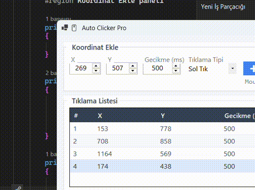

<div align="center">

# 🖱️ Auto Clicker Pro

**Koordinat listesi üzerinden çalışan, modern ve hızlı bir C# (WinForms / .NET 8) otomatik tıklama uygulaması.**

Belirlediğiniz noktaları listeye ekleyin, sırayla veya sonsuz döngüde otomatik olarak tıklatın —
tamamı global kısayol tuşlarıyla, uygulamayı hiç öne getirmeden kontrol edin.

</div>

---

## ✨ Özellikler

| | |
|---|---|
| 🎯 **Konum Yakalama** | Fare imlecinin anlık ekran konumunu tek tuşla (varsayılan `F2`) yakalayın |
| 📋 **Koordinat Listesi** | Her nokta için ayrı **X, Y, gecikme (ms) ve tıklama tipi** (Sol / Sağ / Çift Tık) tanımlayın |
| 🔀 **Liste Yönetimi** | Ekle, sil, tümünü temizle, sırayı yukarı/aşağı taşı |
| 🔁 **Esnek Çalıştırma** | Belirli bir **tekrar sayısı** ile ya da **sonsuz döngü** ile çalıştırın |
| ⌨️ **Global Kısayollar** | Uygulama arka planda/simge durumunda olsa bile `F2` / `F5` / `F6` çalışır |
| ⚙️ **Özelleştirilebilir Tuşlar** | "Kısayol Ayarla" penceresinden istediğiniz tuşları kendiniz atayın — arayüz otomatik güncellenir |
| 🎨 **Modern Arayüz** | Sade renk paleti, düzenli tipografi, flat butonlar ve stilize tablo görünümü |

---

## 🖼️ Önizleme

<div align="center">
  
</div>

📹 Tam kaliteli video kaydı için: [`assets/demo.mp4`](assets/demo.mp4)

Uygulama üç ana bölümden oluşur:

1. **Koordinat Ekle** — X / Y / gecikme / tıklama tipi girip listeye ekleme
2. **Tıklama Listesi** — eklenen tüm noktaların tablo hâlinde yönetimi
3. **Çalıştır** — tekrar sayısı / sonsuz döngü seçimi, Başlat-Durdur ve kısayol ayarları

---

## 🚀 Kurulum ve Çalıştırma

### Gereksinimler

- **Windows** işletim sistemi (uygulama `user32.dll` P/Invoke çağrıları kullanır; Linux/macOS'ta çalışmaz)
- [.NET 8 SDK](https://dotnet.microsoft.com/download)

### Çalıştırma

```bash
git clone <bu-repo>
cd AutoClickerV2
dotnet run
```

Alternatif olarak Visual Studio ile `AutoClickerV2.csproj` dosyasını açıp **F5** ile çalıştırabilirsiniz.

---

## 🎮 Kullanım

1. Tıklatmak istediğiniz noktaya imleci götürün ve **F2** (veya atadığınız tuş) ile konumu yakalayın
2. Gecikme süresini ve tıklama tipini seçip **➕ Listeye Ekle** ile listeye ekleyin
3. Gerekirse birden fazla nokta ekleyip sırasını **▲ / ▼** ile düzenleyin
4. **Tekrar Sayısı** girin ya da **Sonsuz Döngü**'yü işaretleyin
5. **F5** (veya atadığınız tuş) ile başlatın, **F6** ile istediğiniz an durdurun

> 💡 Kısayol tuşlarını değiştirmek isterseniz "⚙ Kısayol Ayarla" penceresinden her işlem için ayrı bir tuş seçebilirsiniz. Aynı tuş iki işleve atanamaz ve çakışma durumunda uygulama sizi uyarır.

---

## 📁 Proje Yapısı

```
AutoClickerV2/
├── Program.cs               # Uygulama giriş noktası
├── Form1.Designer.cs        # Arayüz: kontroller, renk paleti, fontlar, yerleşim
├── Form1.cs                 # İş mantığı: koordinat listesi, tıklama döngüsü, global hotkeyler
├── HotkeySettingsForm.cs    # Kısayol tuşu atama penceresi
├── AutoClickerV2.csproj     # .NET 8 WinForms proje dosyası
├── assets/
│   ├── screenshot.png       # README ekran görüntüsü
│   ├── demo.gif             # README içinde oynatılan demo
│   └── demo.mp4             # Tam kaliteli demo videosu
└── .gitignore
```

---

## 🔧 Teknik Notlar

- Fare tıklamaları `user32.dll`'den `mouse_event` ile simüle edilir
- İmleç konumlandırma `SetCursorPos` ile yapılır
- Global kısayollar `RegisterHotKey` / `UnregisterHotKey` (user32.dll) ile kaydedilir — bu sayede uygulama odakta olmasa da çalışır
- Tıklama döngüsü `async/await` + `CancellationToken` ile arayüzü donmadan yürütülür
- Bir kısayol tuşu başka bir uygulama tarafından zaten kullanılıyorsa kayıt başarısız olur ve kullanıcı bilgilendirilir

---

## 📜 Lisans

Kişisel ve eğitim amaçlı kullanım için serbesttir.
